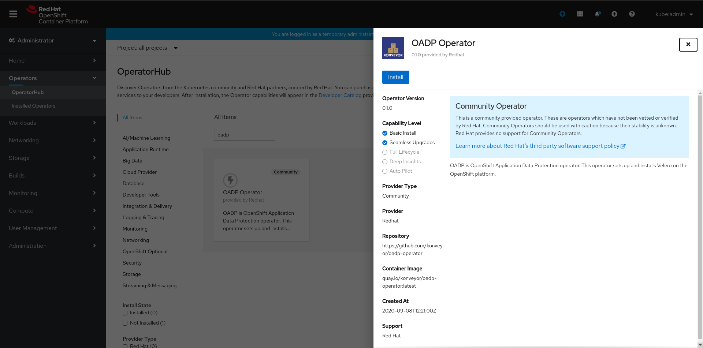

# OADP + Minio Demo
A demo repository to show how OADP works with a generic S3 backend (Minio).

The purpose of this demo is purely to showcase the features of OADP using a simple
backend during labs and workshops on a single cluster.

The demo installs OADP and Minio, creates an example namespace and show the 
backup and restore tasks.
The choice of Minio as an S3 backend is dictated by the will to keep the demo
as simple and minimal as possibile. 

OpenShift users who already installed [ODF](https://www.redhat.com/it/technologies/cloud-computing/openshift-container-storage) 
(OpenShift Data Foundation, aka OpenShiftContainer Storage) can legerave
on Noobaa as an S3 backend with improved performance and reliability results.

### Technologies
[OADP](https://github.com/konveyor/oadp-operator) (OpenShift APIs for Data Protection) 
is an operator that Red Hat has created to create backup and restore APIs in the 
OpenShift cluster. OADP is based on Velero.

[MinIO](https://github.com/minio/minio) is a High Performance Object Storage which 
is API compatible with Amazon S3 cloud storage service.

[Helm](https://helm.sh/) is a package manager for Kubernetes.

### Disclaimer for DR scenarios
This demo is not intended to be a Disaster Recovery example between multiple 
clusters. To achieve Async DR results the integrationwith other tools is necessary.
Some integration examples:
- ODF Data Protection
- IBM Spectrum Protect Plus
- Kasten K10
- TrillioVault for Kubernetes
- Bacula Enterprise

## Install OADP from the OpenShift Console
Install the OADP Operator from the Openshift's OperatorHub. Search for the operator using keywords like `oadp` or `velero`


Now click on Install



Finally, click on subscribe, this will create a namespace named `oadp-operator` if it does not exist and install the OADP operator in it.


## Install OADP from the CLI (Console alternative)
Create the `oadp-operator` namespace.
```
oc create ns oadp-operator
```

Create the OperatorGroup to let the OLM manage the operator in the namespace:
```
oc apply -f resources/oadp-operatorgroup.yaml
```

Create the operator subscription:
```
oc apply -f resources/oadp-subscription.yaml
```

Wait for the installation to complete.

## Install Minio

Create the `minio` namespace:
```
oc create ns minio
```

Install Minio using Helm in the `minio` namespace.
```
helm install -n minio minio minio/minio
```

Expose the minio service as a secure route.
```
oc create route edge minio --service=minio
```

Obtain the Access and Secret from the installed chart. 
```
export ACCESS_KEY=$(kubectl get secret minio -o jsonpath="{.data.accesskey}" | base64 --decode)
export SECRET_KEY=$(kubectl get secret minio -o jsonpath="{.data.secretkey}" | base64 --decode)
```

Generate the `credentials` file using the exported variables:
```
cat > credentials << EOF
[default]
aws_access_key_id=$ACCESS_KEY
aws_secret_access_key=$SECRET_KEY
EOF
```

Generate the `cloud-credentials` secret in the `oadp-operator` namespace to let Velero authenticate
with the S3 backend.
```
oc create secret generic cloud-credentials --namespace oadp-operator --from-file cloud=credentials
```

After installing Minio, and **before** installing the Velero CR, create a 
target bucket inside minio. The bucket name should match with the one defined
in the Velero CR. This demo uses a bucket called `example`.

## Create the Velero resource

The Velero CR is customized to use the generated route. Customize the `s3_url` field with the exposed route.
```
apiVersion: konveyor.openshift.io/v1alpha1
kind: Velero
metadata:
  name: example-velero
  namespace: oadp-operator
spec:
  olm_managed: true
  backup_storage_locations:
    - config:
        profile: default
        region: minio
        s3_url: https://minio-minio.apps.ocp4.rhocplab.com
        s3_force_path_style: true
        insecure_skip_tls_verify: true
      credentials_secret_ref:
        name: cloud-credentials
        namespace: oadp-operator
      name: default
      object_storage:
        bucket: example
        prefix: velero
      provider: aws
  default_velero_plugins:
    - aws
    - csi
    - openshift
  velero_feature_flags: EnableCSI
  enable_restic: true
  volume_snapshot_locations:
    - config:
        profile: default
        region: minio
      name: default
      provider: aws
```

Create the Velero CR.
```
oc apply -f resources/example-velero.yaml
```
## Verify Installation
Check if the Velero resources are all successfully installed:
```
$ oc get all -n oadp-operator
NAME                                            READY   STATUS    RESTARTS   AGE
pod/oadp-default-aws-registry-6fc6698db-gh45z   1/1     Running   0          33h
pod/oadp-operator-85789d5949-2msqr              1/1     Running   0          24d
pod/restic-9wdxz                                1/1     Running   0          33h
pod/restic-dphxp                                1/1     Running   0          33h
pod/restic-gt55r                                1/1     Running   0          33h
pod/restic-hcb2m                                1/1     Running   0          33h
pod/restic-mhpwk                                1/1     Running   0          33h
pod/restic-s9282                                1/1     Running   0          33h
pod/velero-5849fffd4-rf9hz                      1/1     Running   0          33h

NAME                                    TYPE        CLUSTER-IP       EXTERNAL-IP   PORT(S)    AGE
service/oadp-default-aws-registry-svc   ClusterIP   172.30.185.177   <none>        5000/TCP   33h

NAME                    DESIRED   CURRENT   READY   UP-TO-DATE   AVAILABLE   NODE SELECTOR   AGE
daemonset.apps/restic   6         6         6       6            6           <none>          33h

NAME                                        READY   UP-TO-DATE   AVAILABLE   AGE
deployment.apps/oadp-default-aws-registry   1/1     1            1           33h
deployment.apps/oadp-operator               1/1     1            1           141d
deployment.apps/velero                      1/1     1            1           33h

NAME                                                  DESIRED   CURRENT   READY   AGE
replicaset.apps/oadp-default-aws-registry-6fc6698db   1         1         1       33h
replicaset.apps/oadp-operator-8458865795              0         0         0       39d
replicaset.apps/oadp-operator-85789d5949              1         1         1       37d
replicaset.apps/velero-5849fffd4                      1         1         1       33h

NAME                                                       HOST/PORT                                                              PATH   SERVICES                        PORT       TERMINATION   WILDCARD
route.route.openshift.io/oadp-default-aws-registry-route   oadp-default-aws-registry-route-oadp-operator.apps.ocp4.rhocplab.com          oadp-default-aws-registry-svc   5000-tcp                 None
```

## Create a backup target namespace
Create the new namespace and deploy a new appliaction. The follwing example uses
an OpenShift template of NodeJS + MongoDB with persistency.
```
oc new-project example-namespace
oc new-app --template=nodejs-mongo-persistent
```

Wait for the app build completion.
```
$ oc get pods
NAME                               READY   STATUS      RESTARTS   AGE
mongodb-1-deploy                   0/1     Completed   0          2m35s
mongodb-1-lkr8v                    1/1     Running     0          2m31s
nodejs-mongo-persistent-1-6l24f    1/1     Running     0          55s
nodejs-mongo-persistent-1-build    0/1     Completed   0          2m35s
nodejs-mongo-persistent-1-deploy   0/1     Completed   0          60s
```

Verify a PVC was successfully bounded:
```
$ oc get pvc
NAME      STATUS   VOLUME                                     CAPACITY   ACCESS MODES   STORAGECLASS          AGE
mongodb   Bound    pvc-4eae7794-4117-4d37-969d-58702e757eac   1Gi        RWO            managed-nfs-storage   3m27s
```

## Create the backup resource
The backup resource defines the backup parameteres, the storage location (which
is the S3 backend configured in the Velero CR) and the included namespaces.
It is also possible to configure exclusion lists.
**IMPORTANT**: If no inclusions or exclusions are specified the Backup CR targets all the 
cluster namespaces.
The `snapshotVolumes` boolean can be used to enable/disable the volume snapshots (this will
imply a CSI storage driver).
```
apiVersion: velero.io/v1
kind: Backup
metadata:
  namespace: oadp-operator
  name: example-backup
spec:
  storageLocation: default
  snapshotVolumes: true
  includedNamespaces:
    - example-namespace
```

Apply the backup resource.
```
oc apply -f resources/example-backup.yaml
```

Verify the backup was completed successuflly by looking at the objects created
in the Minio console:


**NOTE**: If the storage backend does not support CSI snapshots the volume snapshop will be skipped.
The following kind of message will appear in the Velero logs:
```
time="2021-06-15T18:24:29Z" level=info msg="Persistent volume is not a supported volume type for snapshots, skipping." backup=oadp-operator/example-backup logSource="pkg/backup/item_backupper.go:469" name=pvc-a101734c-f9eb-4f18-9936-57453a88b69c namespace= persistentVolume=pvc-a101734c-f9eb-4f18-9936-57453a88b69c resource=persistentvolumes
```

## Restore resources
After the completion of backup test the restore using the Restore CR offered
by OADP. The following example restores the content of the `example-namespace`:
```
apiVersion: velero.io/v1
kind: Restore
metadata:
  namespace: oadp-operator
  name: example-restore
spec:
  backupName: example-backup
  includedNamespaces:
    - example-namespace
  restorePVs: true
```

Before creating the Restore CR, delete all the resources created in the 
`example-namespace` to test the correct recreation.
```
oc delete all --all -n example-namespace
```

Apply the restore resource.
```
oc apply -f resources/example-restore.yaml
```

When the restore is completed you should see the pods and resources recreated in 
the namespace. Also, you should find the following line in the Velero logs:
```
time="2021-06-16T07:52:04Z" level=info msg="restore completed" logSource="pkg/controller/restore_controller.go:480" restore=oadp-operator/restore
```

## Links
- https://access.redhat.com/articles/5456281
- https://www.openshift.com/blog/hybrid-cloud-disaster-recovery-on-openshift
- https://www.redhat.com/en/resources/openshift-data-foundation-overview

## Maintainers
Gianni Salinetti <gsalinet@redhat.com>  

